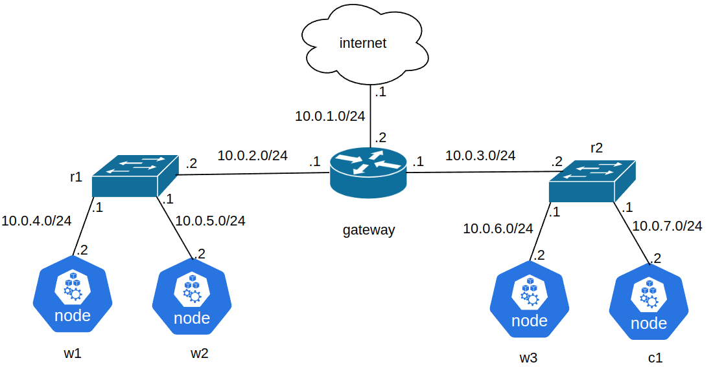

# Kinda-p4

Library for emulation of Kubernetes clusters in complex container-based virtual networks. Kubernetes nodes run in Docker containers (automatically createad by Kind), network devices can be arbitrary Docker containers (e.g. Quagga, BMv2, OpenVSwitch). Intended to be used with Kathara, use it to build network then use this library to have all of the Kubernetes traffic be sent through that virtual network (both K8s node-to-node traffic and inter-node pod-to-pod traffic).

## Why may I need it?

Research related to incorporating network information into Kubernetes. Library was designed as a part of MSc focused on utilizing in-network computing (programmable switches) in Kubernetes. Can run tens of emulated Kubernetes nodes with emulated network devices on customer-grade PCs.

## Requirements
- Linux with ip toolkit, iptables, kubectl and docker (tested on ubuntu with 5.19 kernel)
- Kind 0.18
- Python>=3.10

## Installation

Clone this repo and in the main directory run:

`pip install -r requirements.txt`

To use `kinda` CLI add `src/cli` to your path.

## Running

Create a Python script with your topology and cluster, see [examples/nets](examples/nets) for more info, then run it as a root (required to use iptables, configure Linux namespaces, etc...).

Complex networks can be built with Kathara file system utilities (see examples), tree networks (also backed by Kathara) can be built as follows:

```python
from Kathara.model.Lab import Lab

from net.KatharaBackedNet import KatharaBackedCluster
from topology.Node import (ExternalDeviceMeta, IncSwitchMeta, K8sNodeMeta,
                           NetDeviceMeta)
from topology.Tree import NetworkLink as Link
from topology.Tree import TreeNodeDefinition as Def
from topology.Tree import TreeTopologyBuilder

network = Lab("tree")
builder = TreeTopologyBuilder(
    network,
    root_name="internet",
    device_definitions=[
        Def("internet", ExternalDeviceMeta()),                 # ubuntu-based host
        Def("gateway", NetDeviceMeta(image="kathara/quagga")), # quagga router
        Def("r1", IncSwitchMeta()),                            # p4 programmable switch
        Def("r2", IncSwitchMeta()),
        Def("w1", K8sNodeMeta.Worker()),                       # Kubernetes worker node  
        Def("w2", K8sNodeMeta.Worker()),
        Def("w3", K8sNodeMeta.Worker()),
        Def("c1", K8sNodeMeta.Control())],                     # Kubernetes control plane node  
    links=[
        Link(("internet", "gateway"), ("10.0.1.1/24", "10.0.1.2/24")),
        Link(("gateway", "r1"), ("10.0.2.1/24", "10.0.2.2/24")),
        Link(("gateway", "r2"), ("10.0.3.1/24", "10.0.3.2/24")),
        Link(("r1", "w1"), ("10.0.4.1/24", "10.0.4.2/24")),
        Link(("r1", "w2"), ("10.0.5.1/24", "10.0.5.2/24")),
        Link(("r2", "w3"), ("10.0.6.1/24", "10.0.6.2/24")),
        Link(("r2", "c1"), ("10.0.7.1/24", "10.0.7.2/24"))]
)
builder.setup_network()
with KatharaBackedCluster("example-cluster", network) as cluster:
    builder.attach_and_build_cluster(cluster)
```

Run it with sudo, this will create the following topology on your local machine, all vertices are Docker containers, you can `docker exec -it /bin/bash` into them to see how they are configured. This code does not configure routing by default, you can pass arbitrary Linux startup commands to device definitions to e.g. configure static routing.

<p align="center">
  
</p>


## Usage

Kubectl is automatically configured to interact with the cluster. Cluster-internal traffic is routed only via the provided virtual network (enscapsulted with GRE), user can also enable routing Kubernetes control plane traffic (e.g. Kubectl) through virtual network (which is disabled by default for easier debugging).


Internet access can be enabled through any container in a virtualized network; DockerHub access is routed directly through the host and thus doesn't require enabling internet access in the virtualized network itself (meaning you should be able to download docker images).


Library is packed with simple CLI in [src/cli](src/cli) directory, which basically wraps `docker exec -it` so that you can use for example:

`kinda w1 ip a` to print ip config of node named w1

or 

`kinda w1 bash` to run bash there.

## Other info

Network topology can be built with a classical networking approach by utilizing, for example, the Quagga project (`kathara/quagga` Docker image) or with a SDN approach using, for example, OpenVSwitch (`kathara/sdn` Docker image) or BMv2 (`kathara/p4` Docker image).

Cluster nodes can be bootstrapped with a BMv2 P4 switch acting as a virtual P4-programmable smart NIC.

Note: All of the pod traffic sent between different Kubernetes nodes is automatically encapsulated with GRE, which may have some consequences for underlying network solutions (for example, if you wanted to use P4 switches and access TCP data, now you would also need to account for the deparsing of the GRE header).

## Known Issues

For errors generarated by Kind refer to [their known issues](https://kind.sigs.k8s.io/docs/user/known-issues). Most notably, in case of failure when creating big clusters see (try all of them until the problem is hopefuly solved):
- [inotify reason](https://kind.sigs.k8s.io/docs/user/known-issues/#pod-errors-due-to-too-many-open-files) also see [this thread](https://github.com/kubernetes-sigs/kind/issues/2972)
- [open files reason](https://www.howtogeek.com/805629/too-many-open-files-linux/)
- [docker limitations](https://unix.stackexchange.com/questions/537645/how-to-limit-docker-total-resources)
- [docker out of space](https://unix.stackexchange.com/questions/414483/docker-increase-available-disk-space)


## Debugging

Kubernetes nodes are ubuntu based and come preinstalled with various utilities such as `ping`, `traceroute`, `tcpdump`, `iptables` and `ip` toolkit. To debug deployments usage of node affinity may help, you can assign label to a node by:

`kubectl label node $(kinda reverse <node name>) key=value`

