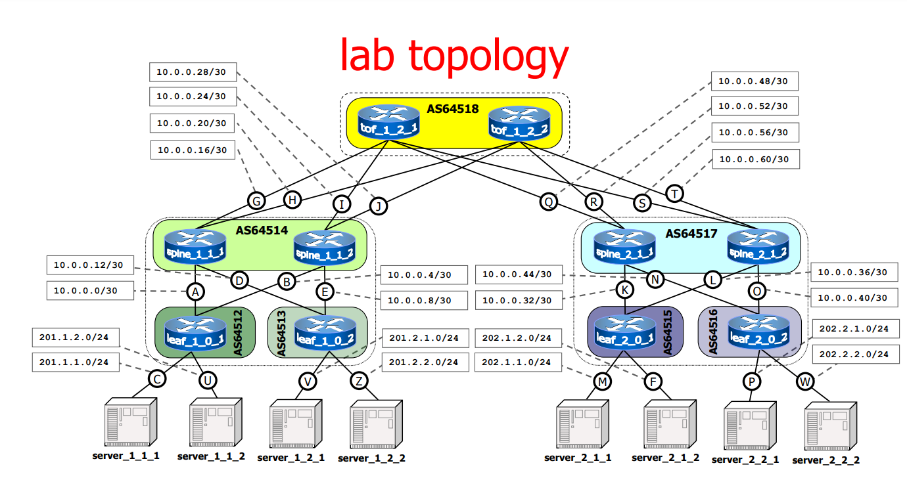

A Fat tree topology setup with classical BGP routing, 8 Kubernetes workers and 1 control plane node.

Note that this setup requires quite a bit of computing resources and might fail, for example Kind may refuse to create the cluster with 9 nodes, you can try to 'cut' this topology leaving just 1 node connected to each leaf. See [known issues](/README.md) for potential fixes.

Control plane node is connected to the `W` network on the image above, same as `server_2_2_2`. Servers are relabeled to w1-w8 from left to right.

Topology taken from [this repo](https://github.com/KatharaFramework/Kathara-Labs/tree/master/Data%20Center%20Routing/kathara-labs_data_center/kathara-data_center-fat_tree_base).
