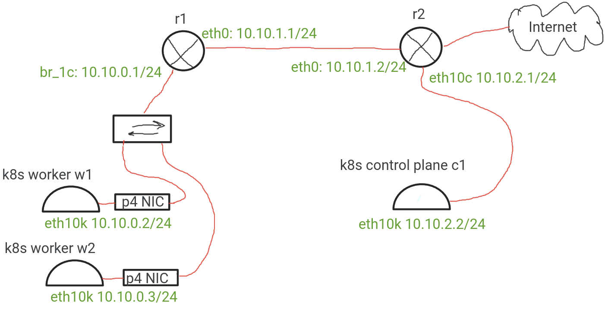

Simple Kathara-based network with 2 Kubernetes workers and 1 control plane node.

Routers `r1` and `r2` are created with Kathara, Kubernetes nodes are created with Kind, then virtual networking is setup to correspond with the image above.  Kubernetes workers have a bmv2 switch based semi-nic with [a simple p4 program](../../p4/basic_arp.p4) that enables simple ipv4 and arp forwading.

# Running

Copy the python script to `src` directory and run it as a root. 

# Testing

You should be able to interract with the cluster using `kubectl`, try running:
- `kubectl apply -f examples/k8s/depl.yaml` 
- `kubectl apply -f examples/k8s/service.yaml`

### TODO this kind of traffic doesn't pass through p4 NIC and maybe should
This will run nginx deployment and open the NodePort service that will allow you to access it via `<ip of any node in kind network>:30007` from the host, where the ip can be obtained with:
- `sudo docker exec -it <any kind container id> ip a`

 by looking for ip of `eth0` (likely `172.18.0.2` or smth like this) in the output. 

### TODO this doesn't work for some p4-related reason
You can also test it from the virtualized network, for example from r2 router by running:
- `sudo docker exec -it <container id of r2> curl 10.10.0.2:30007` 
